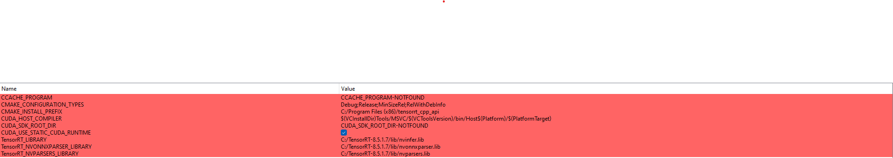

Have you ever seen a deep learning based Tracker engine running at 70 fps on system (4060p vidoe resolution)?

*Drawtrack* is fastest Object Detection + Drawtrack implementation you'll find on the market. Being fast is important but being accurate is curial.

# Getting started

Here, I assume that I am running on my personal computer system with the following configuration:
- CUDA 11.7 
- TensorRT 8.5.1.7
- OpenCV build with CUDA 11.7 [Build OpenCV with CUDA on Windows](https://www.jamesbowley.co.uk/qmd/opencv_cuda_python_windows.html)
- [Eigen 3.4.0](https://gitlab.com/libeigen/eigen/-/releases/3.4.0) 

## Runing on windows:
The next sections are about Windows and C++ API.

*Step 1:* Build library libtensorrt api

This, I use camke GUI for config library



You can change path to requirement library `<your_path_tensorrt>`, `<your_path_cuda>`, `<your_path_opencv>` in `CMakeLists.txt` content:
```cmake
cmake_minimum_required(VERSION 3.18)
project(tensorrt_cpp_api VERSION 1.0.0)

# Use ccache to speed up rebuilds
include(cmake/ccache.cmake)

# For finding FindTensorRT.cmake
set(CMAKE_MODULE_PATH "${CMAKE_SOURCE_DIR}/cmake" ${CMAKE_MODULE_PATH})

# TODO: Specify the path to TensorRT root dir
if (NOT TensorRT_DIR)
    set(TensorRT_DIR "<your_path_tensorrt>")
endif()
# Use the correct version of CUDA
set(CUDA_TOOLKIT_ROOT_DIR <your_path_cuda>/include)

# We require CUDA, OpenCV, and TensorRT
find_package(TensorRT REQUIRED)
find_package(CUDA REQUIRED)
set(OpenCV_DIR "<your_path_opencv>")
find_package(OpenCV REQUIRED)

include_directories(${CMAKE_CURRENT_SOURCE_DIR}/include ${OpenCV_INCLUDE_DIRS} ${CUDA_INCLUDE_DIRS} ${TensorRT_INCLUDE_DIRS})

file(GLOB SRC_LIST src/*.cpp)

add_library(${PROJECT_NAME} SHARED ${SRC_LIST} ${CMAKE_CURRENT_SOURCE_DIR}/include/*.h)
target_include_directories(${PROJECT_NAME} PUBLIC include PRIVATE src)
target_link_libraries(${PROJECT_NAME} PUBLIC ${OpenCV_LIBS} ${CUDA_LIBRARIES} ${CMAKE_THREAD_LIBS_INIT} ${TensorRT_LIBRARIES})
set_target_properties(${CMAKE_PROJECT_NAME} PROPERTIES DEFINE_SYMBOL  "COMPILING_DLL" )
install(TARGETS ${PROJECT_NAME} LIBRARY DESTINATION lib ARCHIVE DESTINATION lib)
install(DIRECTORY include/ DESTINATION include)
```

Open config on Visual Studio and build Release with x64, if successful is show below:

```cmd
    Directory: C:\Projects\Open-Sources\DRAWTRACK\detector\libtensorrt\build\Release

Mode                 LastWriteTime         Length Name
----                 -------------         ------ ----
-a----          7/3/2023   1:43 PM          69632 tensorrt_cpp_api.dll
-a----          7/3/2023   1:43 PM            817 tensorrt_cpp_api.exp
-a----         6/30/2023  10:12 PM           1914 tensorrt_cpp_api.lib
```

*Step 2:* Build library inference-tensorrt api
